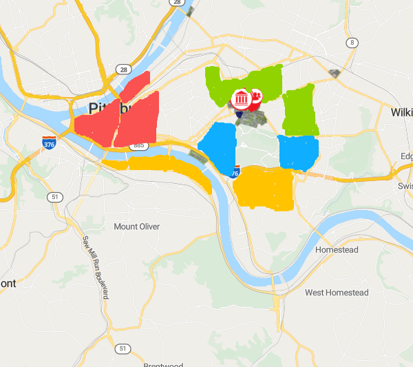

| [home page](https://cmustudent.github.io/tswd-portfolio-templates/) | [data viz examples](dataviz-examples) | [critique by design](critique-by-design) | [final project I](final-project-part-one) | [final project II](final-project-part-two) | [final project III](final-project-part-three) |

# Final Project Part I – JingBo Lin
## Can Students Afford to Live Near CMU Campus?
### A Data Story of Rent and Commute Trade-offs

# 1. Project Overview
Finding a place to live is one of the first big stressors for many CMU students, especially for people who just moved to Pittsburgh and don’t really know the neighborhoods yet. You quickly hear that living near campus in areas like Oakland, Squirrel Hill, or Shadyside is “too expensive,” but choosing a cheaper place farther away usually means more time on the bus, less sleep, and less flexibility in your daily schedule. In reality, students are not just paying rent in dollars — they are also paying in time and energy.

In this project, I want to look more closely at the trade-off between rent and commute time for areas around CMU. I plan to compare neighborhoods that are within walking distance to those that are farther out but still popular among students. Using publicly available data on typical rents and commute times, I’ll build a set of visualizations that show how different housing choices affect both a student’s budget and their daily routine. The goal is not to say “everyone should live here,” but to give current and future students a clearer picture of what they gain or give up when they decide to live closer or farther from campus.

# 2. Project Structure
This section lays out how I expect the story to unfold from start to finish: set up the housing problem, walk through rent and commute patterns, then pull everything together into a few concrete trade-off scenarios.

### 2.1 Introduction: Why Housing Near Campus Feels Unaffordable

- Start by raising the main question: can students realistically afford to live near CMU, and what do we even mean by “near campus”?

- Give a bit of context about CMU’s location and the neighborhoods students talk about the most (Oakland, Squirrel Hill, Shadyside, Bloomfield, etc.).

- Introduce the idea that students are juggling two limits at the same time: a rent budget in dollars, and a “time budget” in minutes spent commuting every day.

Planned visuals:

- A simple locator map showing CMU and the main surrounding neighborhoods, just to orient the reader.

- A short highlighted text box with the core question in one sentence (for example, “Is it worth paying more to live closer to campus?”).

### 2.2 Defining “Near” and “Far”: Distance Bands Around Campus

- Break the area around CMU into a few distance bands (for example: within 1 km, 1–3 km, and more than 3 km).

- Explain that I’ll use these bands later to group neighborhoods or census tracts in the charts.

- Briefly describe how realistic walking, biking, or transit options look in each band (for example, “walkable,” “short bus ride,” “longer commute that depends more on transit”).

Planned visuals:

- A map centered on CMU with shaded rings or bands showing the different distance ranges.

- A few labels or annotations pointing out which neighborhoods fall into each band.

### 2.3 Rent Patterns Around Campus: Where Is It Most Expensive?

- Show median rent by neighborhood, ZIP code, or census tract in areas where students commonly live.

- Compare rent levels across the distance bands, highlighting pockets that are noticeably more expensive or more affordable.

- Use the data to either support or complicate the simple idea that “the closer you live to campus, the more you pay.”

Planned visuals:

- A choropleth map of median rent around CMU, with a clear legend and neighborhood labels.

- A bar chart comparing median rents across a small set of key neighborhoods or across the distance bands.

### 2.4 Commute Time Patterns: What Does It Cost in Minutes?

- Introduce commute time as a second “currency,” alongside rent.

- Show typical travel time to work or school from different neighborhoods or tracts near CMU.

- Highlight how average commute time grows as distance from campus increases, and point out any areas that are “surprisingly close” or “surprisingly far” in terms of time.

Planned visuals:

- A bar or line chart showing average commute time by distance band or neighborhood.

- A supporting map that uses color or symbols to show commute time to campus from different areas.

### 2.5 Trade-offs: Rent vs. Commute in One View

- Put rent and commute time together in a single chart (for example, a scatterplot with commute time on the x-axis and median rent on the y-axis, one point per neighborhood or tract).

- Walk through a few concrete “student scenarios,” such as:

 Living within walking distance, paying more each month, but saving 30–40 minutes per day.

 Living farther out, paying less in rent, but spending much longer on the bus.

 Emphasize that “affordability” is really about the balance between money, time, and daily flexibility, not rent alone.

Planned visuals:

- A scatterplot of rent vs. commute time, with points labeled or color-coded by neighborhood or distance band.

- Text callouts on the chart that guide the reader through two or three example trade-offs.

### 2.6 Conclusion: What Should Students Consider?

- Summarize the main patterns: which areas are the most expensive, which have the longest commutes, and where there seem to be “sweet spots” that balance the two.

- Offer a short list of practical questions students can ask themselves (for example, “If I save $X per month, am I okay with adding Y minutes to my daily commute?”).

- Close by reminding the reader that the project is meant to help them see their options more clearly, not to tell everyone to make the same choice.

Planned visuals:

- A simple summary graphic (such as a small annotated table or diagram) that highlights 2–3 key trade-off insights.

- A final panel inviting students to explore the interactive visualizations and think about how the patterns apply to their own housing decisions.
Text here...

## Initial sketches
> Post images of your anticipated data visualizations (sketches are fine). They should mimic aspects of your outline, and include elements of your story.  

This sketch shows a simple map centered on CMU, with nearby neighborhoods labeled (for example, Oakland, Squirrel Hill, Shadyside, and Bloomfield). I will highlight popular areas around campus, using deeper colors for places that typically have longer travel times. The goal is to give the reader a quick sense of where these neighborhoods are and how long it usually takes to get from home to campus.

The second sketch is a map panel that shades neighborhoods or census tracts by their median monthly rent. In the sketch, I will block out a legend with light to dark tones and highlight a few areas that look especially expensive or relatively affordable. Next to the map, I plan to leave space for a short paragraph explaining what stands out: for example, whether the highest rents are clustered near campus or spread out more widely.

# The data
For this project, I plan to combine nationwide survey data, local indicators, and, if needed, a rental index series to understand both rent levels and commute patterns around CMU.

The main quantitative foundation will come from the American Community Survey (ACS), published by the U.S. Census Bureau. I will use the table B25064: Median Gross Rent (Dollars) to obtain median rent values for renter-occupied housing units at the census tract level in the Pittsburgh area.

 These values represent total monthly housing costs for renters and are well suited for comparing typical rent levels across different neighborhoods. I will also use B08303: Travel Time to Work, which reports how long workers take to commute from home to work.

 By pulling both tables for the same set of tracts, I can align rent and commute time geographically and calculate average travel times for areas at different distances from campus.
https://data.census.gov/table/ACSDT1Y2022.B08303?utm_source=chatgpt.com

To add more local context about housing conditions, I may incorporate indicators from the Western Pennsylvania Regional Data Center (WPRDC). The WPRDC hosts datasets such as Housing Indicators and other housing-related resources for Pittsburgh and Allegheny County, which summarize things like property values, sales, and voucher usage at the neighborhood or tract level.
https://data.wprdc.org/dataset/housing-indicators?utm_source=chatgpt.com

For a broader view of how rents in the Pittsburgh metro area have changed over time, I may also reference the Zillow Observed Rent Index (ZORI) from Zillow Research. ZORI is a smoothed measure of typical asking rents across regions such as metros and ZIP codes and is available as downloadable data on the Zillow Research “Housing Data” page.
https://www.zillow.com/research/data/?utm_source=chatgpt.com

# Method and medium
For the final project, I plan to work mainly with Tableau and a web-based storytelling format. I’ll use Tableau to explore the data, build maps and comparison charts, and create the rent–commute trade-off scatterplot. Once I have a set of visuals that support the story, I’ll place them into a narrative page that the reader can scroll through, so the charts appear at the right moment in the story instead of all at once.

I’ll document my work in my GitHub repository using markdown, and then either set up a project page with GitHub Pages that embeds Tableau Public views, or build a short web story (for example, in a platform like Shorthand) that links back to my portfolio and includes the interactive charts or iframes. The final piece will be a digital, scrollable story rather than a slide deck, and I’ll stay away from PowerPoint and Excel as the main presentation tools. The focus will be on an interactive, web-based experience that matches the tools and examples we’ve been using in class.

## References
_List any references you used here._

## AI acknowledgements
_If you used AI to help you complete this assignment (within the parameters of the instruction and course guidelines), detail your use of AI for this assignment here._
